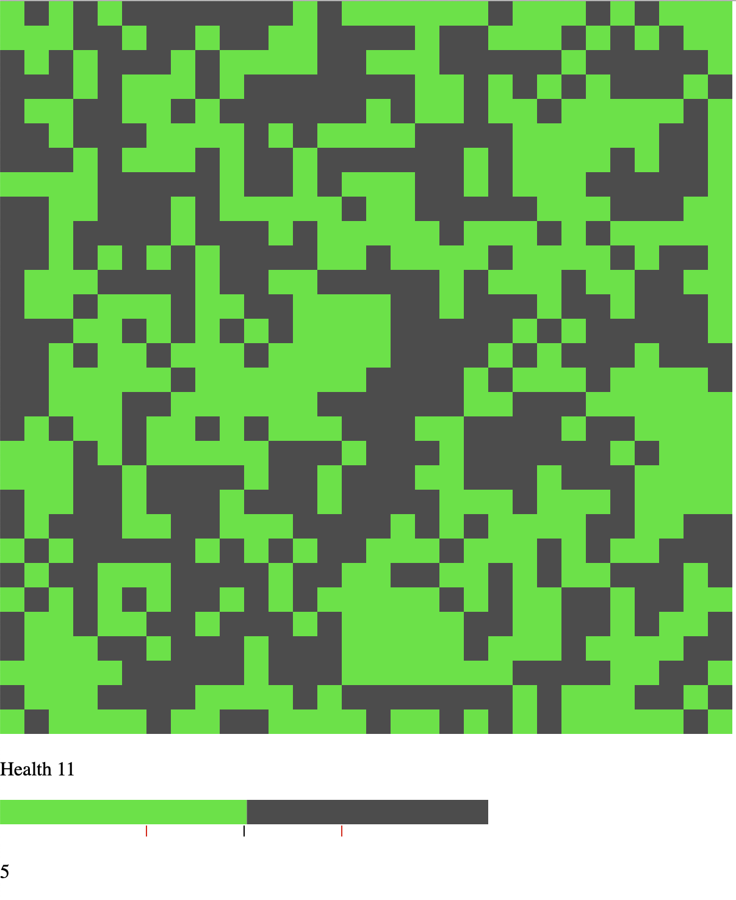
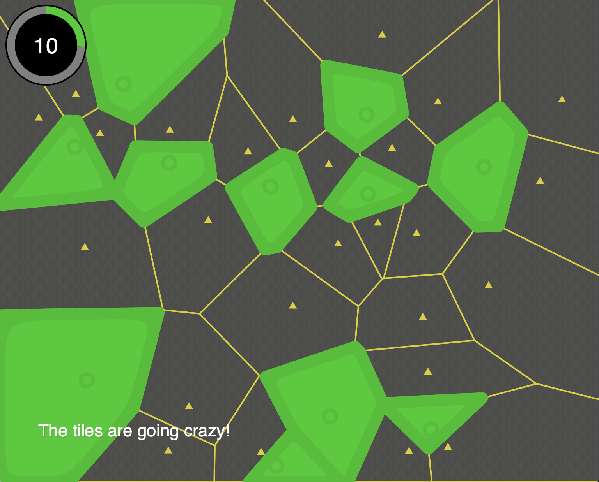

# Equilibrium

Equilibrium is a game that started during the Elm Europe 2019 hackathon. The theme of the hackathon was climate change and the group I was working with settled on a notion of civilization needing to come up with a sustainable balance with the natural world. However, this is difficult because both human civilization and the natural world are complex dynamic systems. Therefore it is not a singular act of establishing perfect balance, but a continous struggle to keep the balance more or less there.

The game we produced during the hackathon is here:

I quite liked the concept as well as a the action packed puzzle like gameplay, but felt it could be extended further. In particular I found the grid presentation somewhat boring an also felt that a more geometric feeling would make the game more unique.

So I spent some evenings hacking on this, and created a newer and different version:

